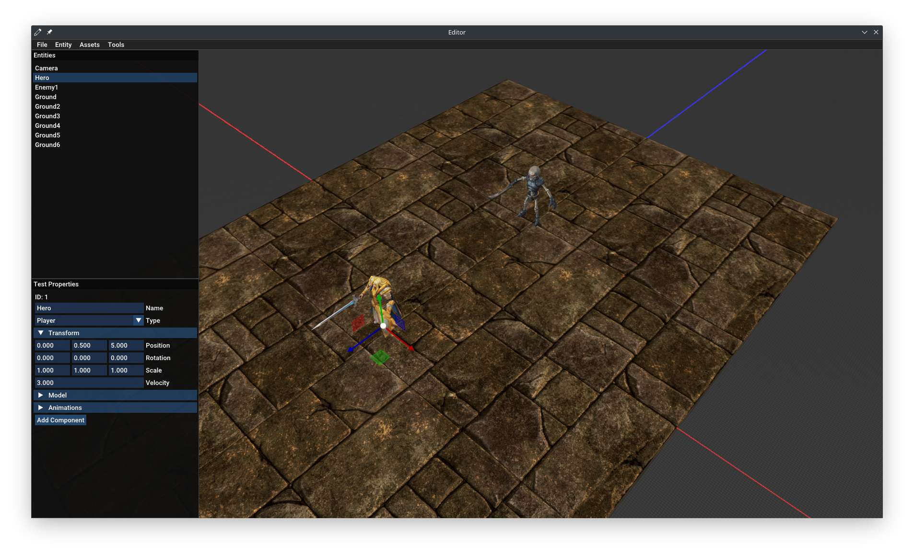
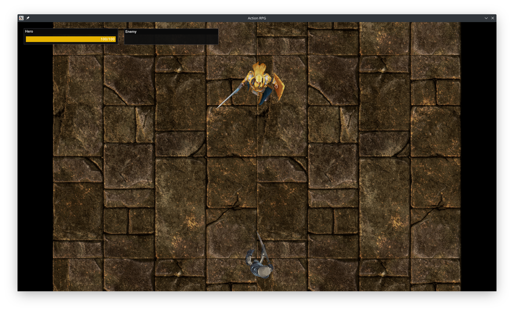

# Action RPG Demo
I worked on this project for 6 months. I started with the focus of learning and practicing, so I learned many concepts about game development that will help me in future projects. Some of these concepts are animations, physics and how game engines work. I have the dream of creating a game engine and use it to create a game. Therefore, this project is a good start for a person with minimal knowledge about videogames and game engine development. This project caused me a lot of pain, because I'm a self-taught person, and I have learned all on videos, courses and books, this is a very slow process, but to me is worth it.

If you read my horrible code and want to tell me how I could be a better programmer, I will really appreciate it. Thank you.

## Models
* [Fantasy Chess RPG Character - Arthur](https://assetstore.unity.com/packages/3d/characters/humanoids/humans/fantasy-chess-rpg-character-arthur-160647)
* [Fantasy Monster - Skeleton](https://assetstore.unity.com/packages/3d/characters/humanoids/fantasy-monster-skeleton-35635)
* [Medieval Fantasy Dungeon Kit](https://assetstore.unity.com/packages/3d/environments/dungeons/medieval-fantasy-dungeon-kit-137477)

## Third Party
All the dependencies are installed by [Conan](https://conan.io) package manager with the [conanfile.txt](conanfile.txt).
* [Vulkan Headers](https://github.com/KhronosGroup/Vulkan-Headers) v1.2.172
* [Vulkan Loader](https://github.com/KhronosGroup/Vulkan-Loader) v1.2.172
* [GLFW](https://www.glfw.org) v3.3.2
* [GLM](https://github.com/g-truc/glm) v0.9.9.8
* [Dear ImGui](https://github.com/ocornut/imgui) v1.83
* [spdlog](https://github.com/gabime/spdlog) v1.8.2
* [stb_image](https://github.com/nothings/stb) 
* [Entt](https://github.com/skypjack/entt) v3.6.0
* [TinyGLTF](https://github.com/syoyo/tinygltf) v2.5.0
* [Nlohmann Json](https://github.com/nlohmann/json) v3.9.1
* [Bullet3](https://github.com/bulletphysics/bullet3) v3.17
* [Sol2](https://github.com/ThePhD/sol2) v3.2.3

### Bindings
This bindings are tools that add functionality for ImGui.
* [ImGuizmo](https://github.com/CedricGuillemet/ImGuizmo) 
* [ImGuiFileDialog](https://github.com/aiekick/ImGuiFileDialog)

## Credits
The resources in this section are all I used for learn some of the key concepts in the project development like as Vulkan, Game design, AI, etc.
* [Learn the Vulkan API with C++](https://www.udemy.com/course/learn-the-vulkan-api-with-cpp/)
* [Vulkan Tutorial](https://vulkan-tutorial.com/Introduction)
* [Sascha Willems example](https://github.com/SaschaWillems/Vulkan)
* [vk-sandbox](https://github.com/tstullich/vk-sandbox) (It help me to know how to implement Dear ImGui with Vulkan)
* [Infinite grid](http://asliceofrendering.com/scene%20helper/2020/01/05/InfiniteGrid/)
* [C++ Cocurrency in Action](https://www.amazon.com/C-Concurrency-Action-Practical-Multithreading/dp/1933988770)
* [Thread Pool Tutorial - How-To](https://youtu.be/eWTGtp3HXiw)
* [Vulkan physically-Based Rendering using glTF 2.0 models](https://github.com/SaschaWillems/Vulkan-glTF-PBR/) (It helped me with loading and rendering animations. Also, with some concepts about render glTf models)

## Editor

## Game
